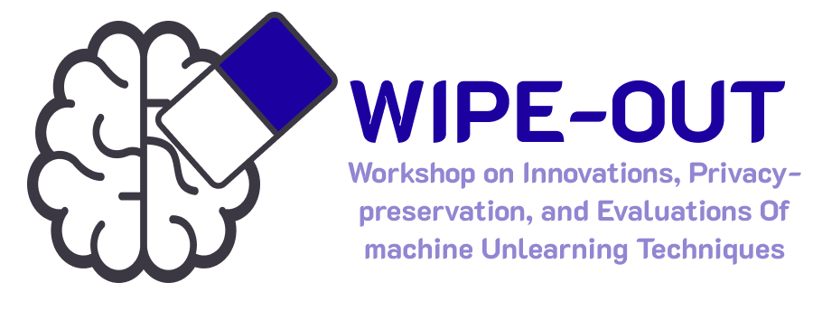

> Why would I want my model to unlearn something? 

This is the most common question I have gotten when describing my research activity. 
The easy answer, and the rationale that almost every paper in the literature pushes, is: to comply with European and the US regulations.

EU's AI ACT, GDPR, California's new regulations, they are all enforcing the *Right to be Forgotten*.
This means that an user can always opt out of a dataset used for training models. If a user requests, every copy of its data must be removed immediately from both the training data and the model.

> But wouldn't that require the model holder to retrain the model from scratch after every unlearning request?

Yes, but that is obviously not doable computationally and economically. The costs would be way too high. 
That's what Machine Unlearning studies: a way to remove the influence of a subset of training data from the model **without** retraining from scratch. 

However, applications do not stop at regulations. Machine Unlearning has been studied to remove adversarial samples from the training set, to understand how models behave in the context of continuous learning, and a lot more. The literature is ever growing, and more and more researchers are turning their attentions to the topic!

Specifically, Google Deepmind is currently hard at work on this topic. We had the pleasure of having Gintare Karolina Dziugaite and Eleni Triantafillou, two senior researchers from Google Deepmind, as speakers to **WIPE-OUT**, our *Machine Unlearning Workshop* at ECML-PKDD. 

 You can find more info, including abstracts from their talks, by clicking on the workshop logo!

Now that we have an idea of what Machine Unlearning is and what it's useful for, the interested reader can take a deeper look at the formally defined workflow that follows. For those who just seeked a broad understanding on what the fuss is about, I hope you now have a clearer picture. (: 

**Machine Unlearning Workflow**
-------

*Figure 1: Machine Unlearning Workflow.*

Figure 1 illustrates a typical workflow in MU. In this setting, an unlearning request is issued by an entity $I_f$, which triggers the partitioning of the original dataset $\mathcal{D}$ into a Forget Set $\mathcal{D}_f$ and a Retain Set $\mathcal{D}_r$, containing respectively the data samples to be removed and those to be preserved. An unlearning algorithm (Unlearner) operates on the original model $M$, which was trained on $\mathcal{D}$. Using both $\mathcal{D}_f$ and $\mathcal{D}_r$, it produces an updated model $M_u$ in which the influence of $\mathcal{D}_f$ should be removed. The objective is to make $M_u$ as similar as possible to the Gold Model $M_g$, which is trained from scratch using only $\mathcal{D}_r$. The similarity between $M_u$ and $M_g$ is typically assessed using a set of measures that capture utility, efficacy, and efficiency.